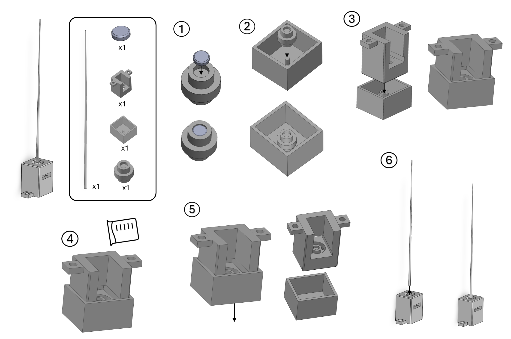

# Build Instructions
1. Glue the magnet into the socket.
2. Place the socket with the magnet attached into the jig. The magnet should face upwards. The pin should slot in easily to secure it in place.
3. Place the base firmly into the jig.
4. Prepare your silicone mixture as per the instructions on the packet. Then pour the silicone mixture into the hole around the socket carefully.
5. Remove the jig carefully, leaving the silicone and the socket in place.
6. Flip the base right-side-up (see image). Place the whisker into the hole in the socket at the top. This may need a gentle push to fit firmly into place.

Click [here](./Docs/build_instructions/Build_Guide.png) for the full-size version of the build guide below.

