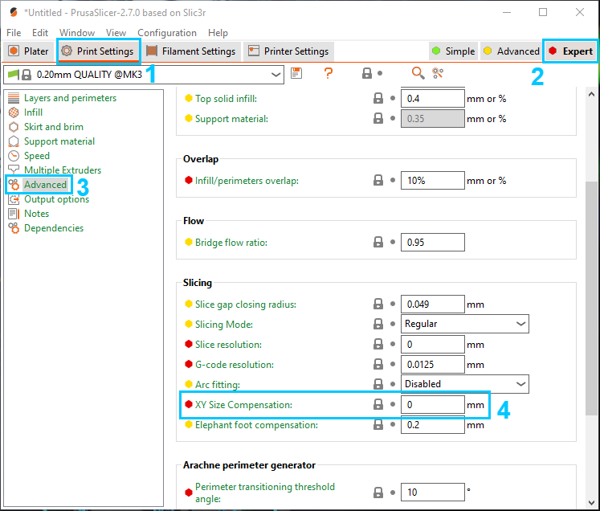
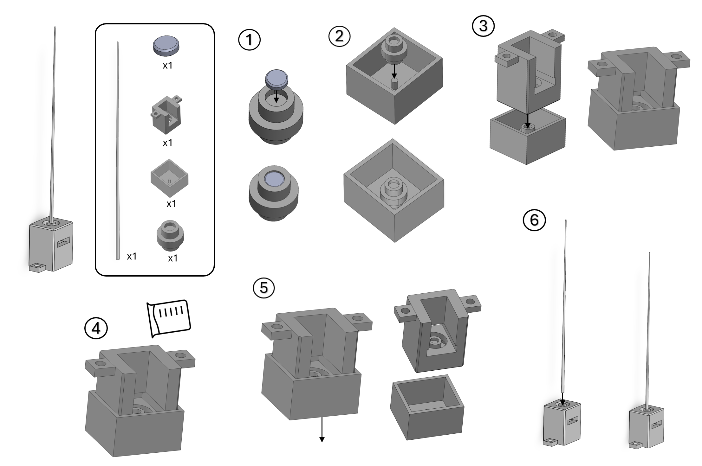
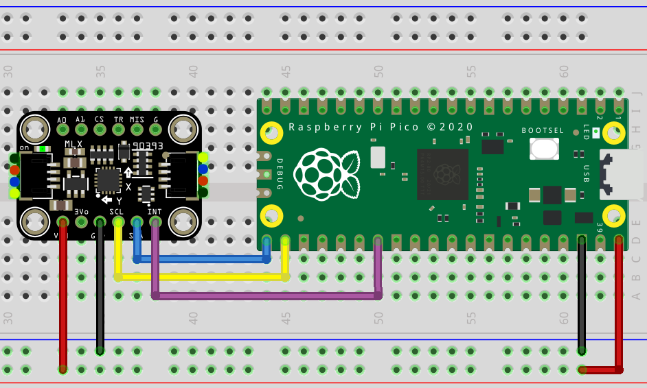

# Ratatouille-Whisker

## Bill of Materials

| Part                | Description                                                                                                                                                                  | Quantity | Cost    |
| ------------------- | ---------------------------------------------------------------------------------------------------------------------------------------------------------------------------- | -------- | ------- |
| 3-axis Magnetometer | [Adafruit Wide-Range Triple-axis Magnetometer - MLX90393](https://www.adafruit.com/product/4022)                                                                             | 1        | £10-£20 |
| Microcontroller     | [Raspberry Pi Pico](https://www.raspberrypi.com/products/raspberry-pi-pico/)                                                                                                 | 1        | £4-£12  |
| 3D Printer Filament | [eSun PLA 1kg Spool](https://esun3dstore.com/collections/pla/products/esun-epla-lite-1-75mm-3d-filament-1kg)                                                                 | 1        | £18     |
| Silicone            | [BBDINO Super Elastic Silicone](https://www.bestbuysilicone.com/collections/all-bbdino-product/products/bbdino-super-elastic-silicone-mold-making-rubber-platinum-trial-kit) | 1        | £28     |
| Magnet              | [1 Tube (10 disks) of 5mm x 2mm Magnet](https://uk.rs-online.com/web/p/neodymium-magnets/2192248)                                                                            | 1        | £8      |
| Demolding Agents    | [Demoulding Vaseline](https://en.pebeo.com/catalogue/vaseline-de-demoulage-gedeo)                                                                                            | 1        | £6      |

## Tools & Equipment

- Required
  - 3D Printer (0.4mm nozzle)
  - Soldering Iron
  - Craft Knife (or equivalent)
- Recommended
  - Prusaslicer (2.7.0 or higher)
  - Deburring Tool

## Software Setup

### General Information

Ratatouille-Whisker is powered by a Raspberry Pi Pico. The Pi Pico was chosen for its low cost and dual-core architecture. One core is responsible for receiving and processing data from the magnetometer through I2C, and the other is responsible for transmitting the results over UART to a computer for post-processing.

The Arduino IDE was used to develop the necessary firmware. The Arduino IDE is a convenient wrapper for the Raspberry Pi Pico SDK and enables rapid prototyping. Developing using the Raspberry Pi Pico SDK is also recommended by the Ratatouille-Whisker team but would require additional development time for library integration.

The [arduino-MLX90393](https://github.com/Ratatouille-Whiskers/arduino-MLX90393) library was forked and modified from Teddy Yapo's original library (see relevant [repo](https://github.com/tedyapo/arduino-MLX90393)). The library was modified to allow I2C addresses to be defined manually in the `begin()` function. The modification was necessary as the sensor boards the team was experimenting with featured I2C addresses that did not align with the respective documentation.

A Python script is also provided as a simple serial port listener (using the `pyserial` library) and logger.

### Step 1: Arduino IDE Setup

Download the official Arduino IDE from [here](https://www.arduino.cc/en/software).

Open up the Arduino IDE and go to `File > Preferences`.
In the dialog that pops up, enter the following URL in the "Additional Boards Manager URLs" field:
```
https://github.com/earlephilhower/arduino-pico/releases/download/global/package_rp2040_index.json
```
Hit *OK* to close the dialog.
Go to `Tools > Boards > Board` Manager in the IDE and type "pico" in the search box and select the entry by "Earle F. Philhower".

[For more information visit the original repository [here](https://github.com/earlephilhower/arduino-pico).]

Open `whisker_firmware.ino` under `software/whisker_firmware` using the Arduino IDE. Select Raspberry Pi Pico as the current board.

Compilation will fail as `MLX90393.h` does not exist.

### Step 2: Install the MLX90393 Library

Go to the library's repository ([here](https://github.com/Ratatouille-Whiskers/arduino-MLX90393)) and click on `Code > Download ZIP`. The library can be installed following the instructions listed [here](https://support.arduino.cc/hc/en-us/articles/5145457742236-Add-libraries-to-Arduino-IDE). Skip to the *Importing a .zip Library* and *Manual installation* sections.

### Step 3: Upload the Code

To upload the sketch, you will need to hold the BOOTSEL button down while plugging in the Raspberry Pi Pico to your computer. Then hit the upload button and the sketch should be transferred and start to run. After the first upload, this may not be necessary as the arduino-pico core has auto-reset support.

### Step 4: Inspect Serial Monitor

In the Arduino IDE, click on `Tools > Serial Monitor` and confirm that values are being printed on the screen.

## Hardware Setup

### Printing Guide

> **`3mf`** project files can be imported directly into your slicing software (we recommend **PrusaSlicer**) for loading in all the part geometries required for printing a complete whisker assembly kit.

Other slicers have not been tested.

> We provide all the **settings** for both the **Prusa MK3S** and **Prusa Mini** printers

Other printers have not been tested.

> Using a **0.4mm nozzle** is recommended.

A smaller nozzle would allow for a better result when printing the whisker shafts - but would result in higher print times.
Smaller nozzles have not been tested.
Please avoid using nozzles larger than 0.4mm to ensure optimal precision and detail.

**Note:** You may find that the fit of the `Whisker Base` is too tight in the casting jig (even with the small chamfers in the design aimed to reduce this), and it is therefore recommended to scrape each of the outer edges of the print with a knife (or deburring tool) to deburr the edges and prevent sticking, in addition to the use of mold release agent. **It is especially important for the areas of the `Whisker Base` that were on the print bed and in contact with the brim when printing.**

#### Slicer Settings

***If users already have their own tuned profiles for their printers, then they can try those settings and use the guidance below for some additional advice on printing.***

We found the default `quality` settings (for 0.4mm nozzles) worked for printing, only requiring two modifications:

> The `Whisker Shaft` should be printed with a **0.1mm** layer height.

> Set `XY Size Compensation`, or your slicer's equivalent setting, to **-0.1mm** - recommended starting point for tuning.

`XY Size Compensation` ensures the holes in the parts are printed with better dimensional accuracy when sliced, improving the fit of parts in each (e.g., Whisker Shaft into the Whisker Socket). 

**DISCLAIMER: DO NOT TAKE THIS TUNING APPROACH AS 'GOOD' ADVICE ON TUNING THIS SETTING FOR ALL PRINTS. IT IS ONLY SUGGESTED FOR PRINTING THESE PARTS AND MAY NOT HELP WITH ALL PRINTS.**

**NOTE: You will need a method to measure an object's inside diameter accurately. We recommend using a set of vernier calipers.**

**Setting `XY Size Compensation` in PrusaSlicer:**

1. Navigate to the `Print Settings` Tab
2. Enable `Expert` mode in the top write of the page
3. From the navigation bar on the left got to `Advanced`
4. Scroll down to till you get to the `Slicing` section where you will find `XY Size Compensation`.



1. Print a `Whisker Bearing Casting Jig`
2. Print a `Whisker Socket`
3. Ensure the smaller hole of the `Whisker Socket` is approx. `3mm` in diameter
4. Ensure the larger hole of the `Whisker Socket` is approx. `5mm` in diameter
<!-- 5. If the measurements are as close to "perfect" to the *true* values and the socket has a snug, but loose enough, fit with the casting jig that it can be easily removed then you should be fine with not tuning the compensation. -->
5. Set `XY Size Compensation` to `Measured - Expected` 
   - Example: measured diameter `2.9mm`, expected diameter `3.0mm`, therefore we set the compensation value to `-0.1mm`
6. Ensure `Whisker Bearing Casting Jig` has a snug fit
<!-- 7. Repeat this till both holes are as close to *true* as you can possibly and the socket has a snug, but loose enough, fit with the casting jig that it can be easily removed then you should be fine with not tuning the compensation. -->
7. Repeat steps 1-6 until you achieve high dimensional accuracy and a snug fit

The default PLA settings of the `Prusament PLA` filament profile may be used for all prints.

### Whisker Build Instructions

To Build the whisker make sure you have printed:

- 1 Whisker Base
- 1 Whisker Socket
- 1 Whisker Shaft
- 1 Whisker Bearing Casting Jig



1. Glue the magnet into the socket.
2. Place the socket with the magnet attached into the jig. The magnet should face upwards. The pin should slot in easily to secure it in place.
3. Place the base firmly into the jig.
4. Prepare your silicone mixture as per the instructions on the packet. Then pour the silicone mixture into the hole around the socket carefully.
5. Remove the jig carefully, leaving the silicone and the socket in place.
6. Flip the base right-side-up (see image). Place the whisker into the hole in the socket at the top. This may need a gentle push to fit firmly into place.

### Sensor Wiring Instructions

The demo firmware (`whisker_firmware.ino`) implicitly indicates a recommended wiring configuration, as seen by:

```c
#define DRDY_pin 21
#define SDA_pin 16
#define SCL_pin 17
```

In detail, please adhere to the following wiring diagram (format `[SENSOR] -- [PICO]`):

- `VIN -- VBUS`
- `GND -- GND`
- `SCL -- GP17`
- `SDA -- GP17`
- `INT -- GP21`

Please consult the wiring diagram:



---

If you wish to use a STEMMA QT / Qwiic JST SH 4-Pin cable, you need only connect `INT` to `GP21` and change the defines to read:

```c
#define DRDY_pin 21
#define SDA_pin 4
#define SCL_pin 5
```

## User Guide

### Logging Data

You are free to use the Python-based script to collect data and save them in a CSV format with timestamps.
Apart from installing Python (from [here](https://www.python.org/)), you also need to install pyserial (see the [repo](https://github.com/pyserial/pyserial)) using pip:
```
pip install pyserial
```

You can now navigate to `software/whisker_listener` and run `python whisker_listener.py -h` to be greeted with useful instructions on how to use the script:

```
usage: whisker_listener.py [-h] [-b BAUD_RATE] serial_port

Read data from a serial port.

positional arguments:
  serial_port   Serial port name (e.g., COM3 or /dev/ttyACM0)

options:
  -h, --help    show this help message and exit
  -b BAUD_RATE  Baud rate (default is 115200)
```

On Linux systems, the data can be logged using:
```
python whisker_listener.py /dev/ttyACM0
```

## General Testing
## Troubleshooting Guide
## How to Contribute?
## Cite Ratatouille-Whisker

```
TBA
```

## License
This work is provided under GPL license for the software source code and CERN-OHL-W license for the hardware design and build instructions.